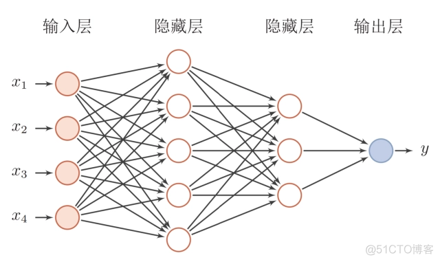

# Pytorch初体验

之前在Intel做的事情都是CPU相关的，尽管久闻Pytorch大名，但是一直没有契机学习。今年加入了NVIDIA，做的都是机器学习相关的东西，跨度有些大，很多基础知识都要从头学起，这几天学习Pytorch，运行起了图像识别界的Hello World——MNIST，识别手写数字。在这个过程中，大致理解了Pytorch的架构与原理，故此记录。

我觉得Pytorch可以从如下四个层次依次理解：
1. 封装好的网络层与激活函数
2. 模型类定义与约定
3. 自动求导与反向传播
4. 设备选择

## 封装好的网络层与激活函数

我们知道，一个最简单的全连接神经网络是这样的：



数据从左边到右边的过程就是前向传播，如果把[x1 x2 x3 x4]记作X，那么整个计算过程就是三步：
1. X' = f1(X * W1 + B1)
2. X" = f2(X' * W2 + B2)
3. Y = f3(X" * W3 + B3)

如果完全按照图中的节点数来实现，那么X是一个行向量，也就是1x4矩阵。第一个隐藏层的W1是4x5矩阵，B1是1x5矩阵。第二个隐藏层的W2是5x3矩阵，B2是1x3矩阵。输出层的W3是3x1矩阵，B3是1x1矩阵。这个过程完全可以手工实现，并不困难，只需要实现矩阵乘法和激活函数即可。

而如果用Pytorch来实现，那连矩阵定义、矩阵乘法实现都不需要手工做了，代码如下：

```python
import torch

hidden_layer_1 = torch.nn.Linear(in_features = 4, out_features = 5)
hidden_layer_2 = torch.nn.Linear(in_features = 5, out_features = 3)
output_layer = torch.nn.Linear(in_features = 3, out_features = 1)

f1 = torch.nn.functional.relu
f2 = torch.nn.functional.gelu
f3 = torch.nn.functional.sigmoid

X = torch.Tensor([1, 2, 3, 4])
X1 = f1(hidden_layer_1(X))
X2 = f2(hidden_layer_2(X1))
Y = f3(output_layer(X2))

print(Y)
```

是的，Pytorch自带了各种流行的网络层和激活函数，都在`torch.nn`和`torch.nn.functional`两个包里。除了最简单的全连接层Linear外，还有卷积层、池化层等等。是不是非常方便呢？

## 模型类定义与约定

但是这样一个“散装网络”终究不是个事儿，我们必须封装成一个类才能在将来的代码中复用，比如这样：
```python
import torch

class MyNet:

    def __init__(self):
        self.hidden_layer_1 = torch.nn.Linear(in_features = 4, out_features = 5)
        self.hidden_layer_2 = torch.nn.Linear(in_features = 5, out_features = 3)
        self.output_layer = torch.nn.Linear(in_features = 3, out_features = 1)

    def calculate(self, x):
        x1 = torch.nn.functional.relu(self.hidden_layer_1(x))
        x2 = torch.nn.functional.gelu(self.hidden_layer_2(x1))
        y = torch.nn.functional.sigmoid(self.output_layer(x2))
        return y

net = MyNet()
X = torch.Tensor([1, 2, 3, 4])
Y = net.calculate(X)
print(Y)
```

那么如何知道这个网络总共有多少个参数（权重+偏置）呢？只有把他们都拿出来才能训练呀。很简单，`torch.nn`中每一个层都提供了`parameters()`方法用来获取其参数，比如
```python
print(list(net.hidden_layer_1.parameters()))
```
会得到如下输出：
```
[Parameter containing:
tensor([[ 0.1818,  0.2153,  0.1542, -0.3910],
        [-0.3314,  0.2885,  0.3696,  0.0749],
        [ 0.3470,  0.3764,  0.2103, -0.2372],
        [-0.4396, -0.4659, -0.2315,  0.3671],
        [ 0.0987, -0.2240, -0.4442, -0.3903]], requires_grad=True), Parameter containing:
tensor([-0.4705,  0.1928,  0.3465,  0.1575, -0.3282], requires_grad=True)]
```
于是我们看到了第一个隐藏层的权重矩阵和偏置向量。如果要获取所有的参数，只要把各个层的`parameters()`的返回串在一起就行了。不过更简单的办法是让`MyNet`继承`torch.nn.Module`类，然后调用`parameters()`方法。该方法会遍历当前对象的所有成员变量，如果成员变量也是一个`Module`实例，则递归地调用其`parameters()`方法，将其返回的参数加入最终的结果中。`torch.nn`中的各种网络层都是`Module`的子类，都实现了`parameters()`方法，用以返回其内部的参数。如此，不需要我们手工实现任何逻辑，MyNet类中的各个层的参数就会自动被“捕捉”到。完整代码如下：
```python
import torch

class MyNet(torch.nn.Module):

    def __init__(self):
        super().__init__()
        self.hidden_layer_1 = torch.nn.Linear(in_features = 4, out_features = 5)
        self.hidden_layer_2 = torch.nn.Linear(in_features = 5, out_features = 3)
        self.output_layer = torch.nn.Linear(in_features = 3, out_features = 1)

    def calculate(self, x):
        x1 = torch.nn.functional.relu(self.hidden_layer_1(x))
        x2 = torch.nn.functional.gelu(self.hidden_layer_2(x1))
        y = torch.nn.functional.sigmoid(self.output_layer(x2))
        return y

net = MyNet()
print(list(net.parameters()))
```
我们能看到如下输出：
```
[Parameter containing:
tensor([[ 0.0521, -0.1112,  0.1144, -0.2454],
        [-0.2202, -0.4775,  0.2756, -0.0661],
        [-0.4681, -0.1311,  0.1118,  0.3272],
        [ 0.1397,  0.3791, -0.4264,  0.1692],
        [ 0.2889,  0.1045, -0.0503, -0.0422]], requires_grad=True), Parameter containing:
tensor([-0.0971, -0.2291, -0.1791, -0.3501,  0.1163], requires_grad=True), Parameter containing:
tensor([[-0.1057,  0.0497, -0.3416, -0.2169,  0.2272],
        [-0.2966,  0.3917, -0.0689, -0.4177,  0.0049],
        [ 0.3094, -0.2871,  0.3142,  0.1697,  0.4424]], requires_grad=True), Parameter containing:
tensor([0.4196, 0.2012, 0.2074], requires_grad=True), Parameter containing:
tensor([[ 0.3101,  0.1310, -0.1311]], requires_grad=True), Parameter containing:
tensor([-0.1684], requires_grad=True)]
```
从矩阵形状就可以看出这些参数分别是上述的W1、B1、W2、B2、W3和B3。但是需要注意的是，**支持“参数自动捕捉”的网络层必须是当前对象的直接成员变量，如果成员变量是一个包含了网络层对象的list、dict或者其他容器类型，那么容器内的网络层对象是不能被捕捉到的。**

现在我们有`calculate()`来执行网络推理（前向传播），这没有任何问题，但是更标准的做法是实现`forward()`来执行推理，这样便能使用`__call__()`来调用，比如：
```python
import torch

class MyNet(torch.nn.Module):

    def __init__(self):
        super().__init__()
        self.hidden_layer_1 = torch.nn.Linear(in_features = 4, out_features = 5)
        self.hidden_layer_2 = torch.nn.Linear(in_features = 5, out_features = 3)
        self.output_layer = torch.nn.Linear(in_features = 3, out_features = 1)

    def forward(self, x):
        x1 = torch.nn.functional.relu(self.hidden_layer_1(x))
        x2 = torch.nn.functional.gelu(self.hidden_layer_2(x1))
        y = torch.nn.functional.sigmoid(self.output_layer(x2))
        return y

net = MyNet()
X = torch.Tensor([1, 2, 3, 4])
Y = net.forward(X)
print(Y)
Y = net(X)
print(Y)
```
通过输出值可以断定`net.forward(X)`与`net(X)`是等价的。

## 自动求导与反向传播

现在我们已经有了一个可以执行前向传播的网络。那么如何训练呢？训练的核心在于求出各个参数对于最终结果的贡献度——也就是导数。

Pytorch支持自动求导。但这是怎么实现的呢？神经网络中无非就是乘加运算和一些激活函数。乘法的导数是另一个乘数，加法的导数是1。比如`y=x*2`，很显然y关于x的导数就是2。再比如`z=x*y+b`，那么z关于x的导数是y，z关于y的导数是x，z关于b的导数是1，都是中学数学的知识。矩阵运算只不过是一堆乘加运算，所以求导也不难。我刚接触Pytorch时一直困惑它是怎么实现对一个激活函数f(x)自动求导的，难道是取一个很小的d，然后计算`(f(x+d)-f(x))/d`吗？后来发现我对Pytorch的神秘感来自于我不正确的预设：我以为Pytorch能够对任意一个函数自动求导，比如我随便用Python实现一个自定义的函数作为激活函数用于网络中。后来得知Pytorch所谓的自动求导只是支持`torch.nn.functional`包里自带的那些激活函数，这些事先实现好的激活函数的导数公式都是已知的，那就没什么稀奇的了。于是每一层中，输出关于输入的导数都是可以确定的，那么就可以从最终的输出层一层层反向计算每一层中的每个参数的导数。

让我们执行代码：
```python
net = MyNet()
X = torch.Tensor([1, 2, 3, 4])
Y: torch.Tensor = net(X)
print(Y)
Y.backward()
print(net.output_layer.weight.grad)
```
看到了如下输出：
```
tensor([0.4879], grad_fn=<SigmoidBackward0>)
tensor([[0.0613, 0.0056, 0.0117]])
```
第二个1x3的矩阵就是output_layer的三个权重关于Y的导数。每一个Tensor对象都有grad成员，也是一个同样维度的Tensor，对应每个参数的导数。必须要注意的是，只有对结果调用`backward()`后，沿途的参数才会有导数，因为导数的计算依靠链式法则，必须反向传播。这里`tensor([0.4879], grad_fn=<SigmoidBackward0>)`中的grad_fn也印证了我上面的说法，即`torch.nn.functional`中的激活函数都是自带了对应的导数函数，使用了激活函数Sigmod那么对应的导数就是`SigmoidBackward0`，在计算过程中都会被记录在所生成的Tensor里，这样才能反向计算各个层的导数。

有了导数之后就可以训练了。除了模型本身外，与训练相关的另外两个概念是损失函数与优化器。

损失函数是评估模型质量的方法，看着标准答案（训练标签）给模型的输出打分，只不过这个分数代表的错误的程度，越接近0越好。这个分数就是整个模型的训练目标。我们的理想目标是让分数为0，根据模型中的每一个参数对于这个分数的导数，就可以确定每个参数的调整方向。在上面的例子中，输出只有一个y，于是每个参数都有一个对于y的导数，是一个标量。但是如果最终输出的维度有N维，那么每个参数对每个输出都有一个导数，也就是有了N个导数，或者说N维的偏微分，那到底如何更新每个参数呢？**损失函数的一个必要性在于，它将多维的输出转为一维的评分标量，从而让模型中的每个参数都有了一个明确的、具体的调整方向**。常见的损失函数有方差（即各维度差的平方之和，几何上就是输出与标签之间的L2距离），还有交叉熵等等，都在`torch.nn`包中，以Loss结尾的类。

优化器则实现了一种更新算法，比如基本的梯度下降法，就是每一步都沿着能让损失函数减少最快的方向更新。还有一些变种算法，比如为了能够跳出局部最优解，增加了动量的概念，不仅要考虑梯度，还会考虑之前的调整参数的方向与速度，这样即使到了局部极小值，也有可能因为惯性冲出去，等等。优化器实现在`torch.optim`包中。

## 设备选择

Pytorch还支持用很少的代码将模型迁移到不同设备上，通过`to()`方法实现，比如将模型迁移到GPU上：
```
device = torch.device("cuda:0")
net = net.to(device)
```
`to()`方法还能实现数据类型转换和异步拷贝。比如在训练时，当模型在执行当前的minibatch时，就可以异步拷贝下一个minibatch到GPU上。

MNIST完整的例子可以看下一篇博客《[Pytorch实现MNIST手写数字识别](../Pytorch实现MNIST手写数字识别/README.md)》。
