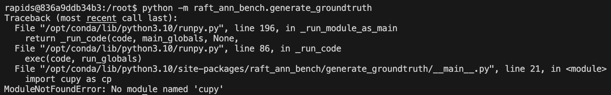
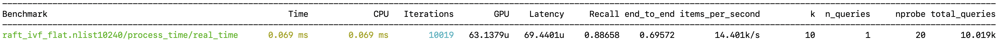
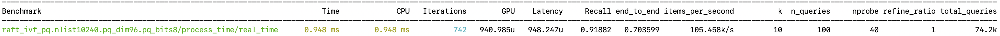

# RAFT性能测试

这篇记录一下如何运行起RAFT的性能测试。参考的原始文档在[这里](https://docs.rapids.ai/api/raft/legacy/raft_ann_benchmarks/)。

## 物理机的准备

创建一个目录，里面放好四个文件：[dataset.yaml](./dataset.yaml)、[ivf_flat.yaml](./ivf_flat.yaml)、[ivf_pq.yaml](./ivf_pq.yaml)和[subset.cpp](./subset.cpp)。之后执行命令：
```
chmod a+rwx `pwd`
```
这是为了在docker容器内可以正常访问当前目录的文件。

## 启动docker容器

官方文档中的做法之二是启动[这个页面](https://hub.docker.com/r/rapidsai/raft-ann-bench/tags)中的某个docker image，比如`rapidsai/raft-ann-bench:24.10a-cuda12.5-py3.11`，里面集成了RAFT需要的工具包，可以直接使用，不需要额外安装了。但是经过实践我发现有一个问题，就是没法对一个大数据集抽取一个子集并生成groundtruth。具体而言：
1. RAFT工具包中没有一个可以从大数据集中随机抽取一个小数据集的工具，需要自己开发。由于数据集都是二进制的，用C/C++读写非常自然，但这些images都没有自带GCC的环境。
2. 有了小数据集后，还需要调用`raft_ann_bench.generate_groundtruth`生成对应的groundtruth。但是这些images有个bug，就是没有集成该工具所需的库。比如：

于是我想到，我手工安装一下GCC和cupy，结果不仅时间很久，而且即使安装完cupy后，还要安装pylibraft，而安装pylibraft就跟docker image自带的冲突了，会把原本的pylibraft卸载了重装，非常耗时。

最终我决定还是以一个简单的docker image为基础，并且按照官方文档中的*Conda*方案在容器内安装RAFT。具体命令如下：
```
docker run --gpus all --rm -it \
    -v `pwd`:/workspace \
    --workdir /root \
    nvcr.io/nvidia/pytorch:24.08-py3
```
选用这个docker image，是因为它已经集成了CUDA、Python和Python GPU开发的基础库。

## 搭建环境

安装wget：
```
apt update
apt upgrade -y
apt install -y wget
```
再利用wget下载mamba：
```
wget https://github.com/conda-forge/miniforge/releases/latest/download/Mambaforge-Linux-x86_64.sh
```
之后就能安装、创建mamba环境了：
```
chmod +x Mambaforge-Linux-x86_64.sh
./Mambaforge-Linux-x86_64.sh -b
source ~/mambaforge/bin/activate
mamba create --name raft_ann_bench
conda activate raft_ann_bench
```

在mamba环境内安装RAFT和相关依赖：
```
mamba install -y -c rapidsai -c conda-forge -c nvidia raft-ann-bench=24.08 pylibraft cupy
```

## 准备数据集

如下命令下载deep-image-96数据集，该数据集中包含10 million条96维向量。
```
python -m raft_ann_bench.get_dataset \
    --dataset deep-image-96-angular \
    --normalize
```

如果就是需要使用10M的数据集测试，那么就无需后续的处理。但是我需要抽取一个3M数据集。这就需要用到[subset.cpp](./subset.cpp)：
```
g++ /workspace/subset.cpp -o subset
```
然后抽取数据集：
```
mkdir -p datasets/deep-image-96-inner-3M
./subset \
    datasets/deep-image-96-inner/base.fbin \
    datasets/deep-image-96-inner-3M/base.fbin \
    3000000
```

这里拓展一下，fbin的格式为：uint32的向量个数n，uint32的向量维度d，之后是n个d维的float32向量。所以文件总大小应该是4+4+n\*d\*4。对于上述命令，`datasets/deep-image-96-inner-3M/base.fbin`的大小应为1152000008字节，可以检查一下：
```
ls -l datasets/deep-image-96-inner-3M/base.fbin
```

有了数据集之后，就可以使用如下命令生成查询集和groundtruth：
```
python -m raft_ann_bench.generate_groundtruth \
    --n_queries 10000 \
    --queries random-choice \
    --metric sqeuclidean \
    -k 100 \
    --output datasets/deep-image-96-inner-3M \
    datasets/deep-image-96-inner-3M/base.fbin
```

需要提醒一下，[官方文档](https://docs.rapids.ai/api/raft/legacy/ann_benchmarks_dataset/#generate-ground-truth)中对于`raft_ann_bench.generate_groundtruth`的参数描述与实际命令不符，即命令要求dataset是最后一个positional参数，而文档中却使用`--dataset`参数。甚至连命令的help输出最后的example里面也是用的`--dataset`。应该是某次代码更新的时候忘记更新文档了……

## 运行测试

使用如下命令运行IVFFlat的测试：
```
python -m raft_ann_bench.run \
    --dataset-configuration /workspace/dataset.yaml \
    --configuration /workspace/ivf_flat.yaml \
    --dataset deep-image-96-inner-3M \
    --algorithms raft_ivf_flat \
    -k 10 \
    --batch-size 1
```

[dataset.yaml](./dataset.yaml)枚举了所有的数据集，每一数据集都是以`-`开头，然后所有行都缩进。数据集有name即数据集名称，有base_file、query_file和groundtruth_neighbors_file分别记录相应的向量文件的路径，有dims即向量维度，以及distance记录数据集使用的距离类型。目前只有`deep-image-96-inner-3M`一个数据集，我们可以按需添加多个。

[ivf_flat.yaml](./ivf_flat.yaml)中定义了一个算法，name记录了算法名字`raft_ivf_flat`，不可以随意取名，否则benchmark工具就找不到具体的代码了。groups枚举了所有的测试group，每个group里面又分为build和search两段。build段中枚举了build阶段所有参数的可能取值，search段枚举了search阶段所有参数的可能取值。一个group中会测试的所有组合就是所有参数的取值的笛卡尔积。如果不显式指定，那么只会运行名为base的测试group。所有的算法和参数可以参考[官方文档](https://docs.rapids.ai/api/raft/legacy/ann_benchmarks_param_tuning/)。注意，不同于数据集的yaml文件，一个yaml文件里只能定义一个算法。同样的，[ivf_pq.yaml](./ivf_pq.yaml)定义了IVFPQ算法的参数。

有了这两个配置文件描述了数据集和算法的细节后，在命令中只需要指定具体要用的数据集和算法的名称。最后还有所有算法都通用的top k和batch size。

[ivf_flat.yaml](./ivf_flat.yaml)里面的参数为`nlist=10240, nprobe=20`，运行后可以看到一行输出：
其中Time、Recall和items_per_second便是总时间、召回率和吞吐率。

同样的，执行
```
python -m raft_ann_bench.run \
    --dataset-configuration /workspace/dataset.yaml \
    --configuration /workspace/ivf_pq.yaml \
    --dataset deep-image-96-inner-3M \
    --algorithms raft_ivf_pq \
    -k 10 \
    --batch-size 100
```

可以看到如下输出：
