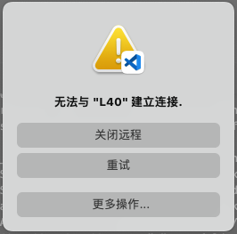

# Remote-SSH换CPU架构后连接失败

之前一直在使用vscode的Remote-SSH插件远程开发，今天换了一台服务器，结果连接时出现这样的错误：



后来试验发现，问题在于之前的服务器是x86架构的，而新的服务器是ARM架构的。仔细观察输出日志，看到这么几行：
```
[17:20:30.361] > Found existing installation at /home/yuxinz/.vscode-server...
```
和
```
[17:20:30.390] > Exec server process not found
> main: line 324: /home/yuxinz/.vscode-server/code-5437499feb04f7a586f677b155b039bc2b3669eb: cannot execute binary file: Exec format error
```

那么因果链就明了了：之前在`/home/yuxinz/.vscode-server`中安装了x86版本的服务器程序，现在切换到了ARM服务器，而vscode以为之前安装的能直接用，于是没有重新下载ARM版本，而是直接在ARM上用了x86版本的程序，那必然是崩溃的。

解决办法很简单，开一个终端连上服务器，然后
```
rm -rf /home/yuxinz/.vscode-server
```

再重新用vscode连接即可。这样就会重新下载ARM服务器了。

这难道是vscode的bug？为什么vscode不检查一下已有的服务器程序的目标平台与当前平台是否匹配呢？

这其实不是bug。正常情况下，一台物理机是不可能随意换CPU架构的，因此把服务器程序放在home目录下，就等于与这条物理机绑定了。连接另一台物理机，那么就使用另一台物理机上的home目录。但是公司里的情况比较特殊，home目录是放在NFS（网络文件系统）上的，你用哪台机器，home目录就被动态地挂载到了某台机器上，于是出现了home目录与物理机解绑的情况。