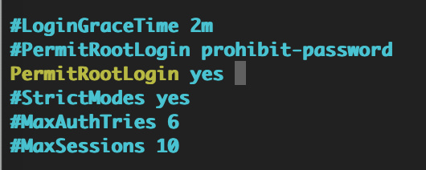
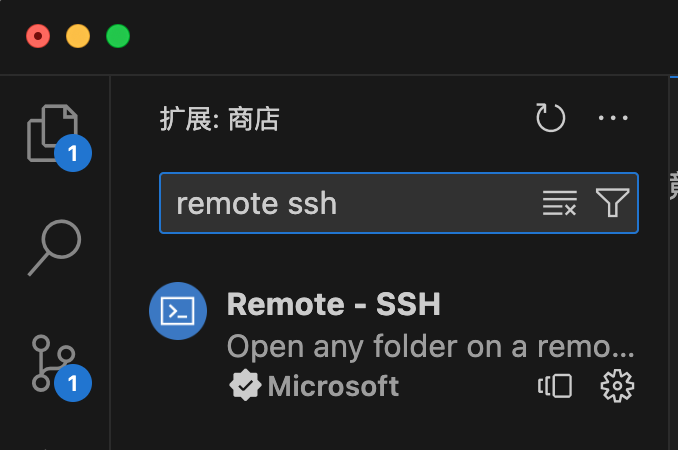
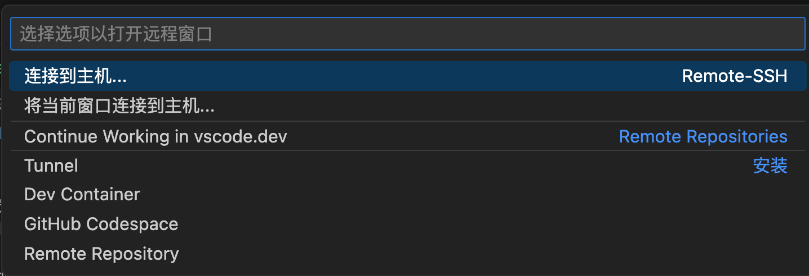
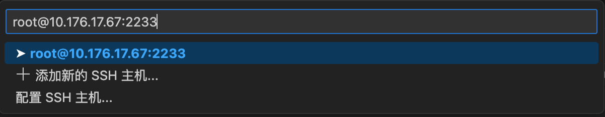
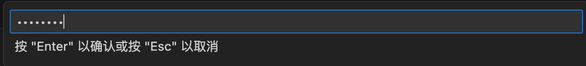
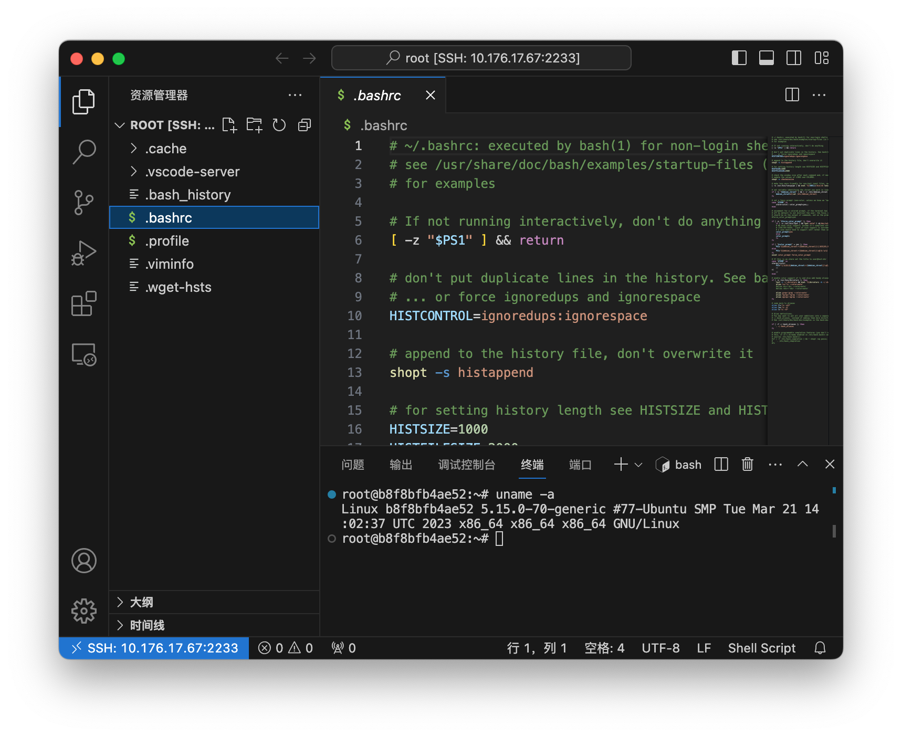

# 基于vs code + docker的远程开发环境

## 背景

公司内部使用服务器集群，按需分配，连上一台机器最多使用10小时。如果某台机器被占用了，那就只能找别的机器使用。这种情况下，如果每天上班第一件事情就是重新配置开发环境，那么真的太痛苦了。因此公司内的best practice就是使用docker。自己的环境就都配置在自己的docker内，下班了就把docker保存，下次要用时重新run就行了。这样就把软件环境与物理机器分离开了，也能避免同事之间因为环境问题互相干扰。

Visual Studio Code作为最强IDE（不接受反驳），不仅可以很方便地在本机开发代码，也可以使用诸如Remote SSH等插件进行远程开发。所谓远程开发，就是所有文件都在服务器上（包括代码、编译器、依赖的库等等），唯独IDE在本地（比如笔记本）。如果服务器上已经配置好了所有环境，那么本地只需要安装好vs code即可，仿佛这个vs code是运行在服务器上，而本地只是一个远程桌面似的。

于是自然而然就有了软件开发的best practice：本地使用vs code连接服务器上的docker。

## 步骤

### >>>以正确姿势启动docker container

以ubuntu镜像为例，使用如下命令在服务器上启动docker：

```bash
docker pull ubuntu
docker run -it -p 2233:22 ubuntu:latest bash
```

其中-p 2233:22的含义是把物理机的2233端口映射到container的22端口（22即为ssh服务默认端口）。这样，连接物理机的2233端口就等价于连接container的22端口。

然后在container内部安装ssh：

```bash
apt-get update
apt-get install -y openssh-server
```

在启动ssh服务前，需要修改一下配置文件，允许以root登录：

```bash
apt-get install -y vim
vim /etc/ssh/sshd_config
```

找到PermitRootLogin字段，修改为
```
PermitRootLogin yes
```



然后就可以启动ssh服务：

```bash
service ssh start
```

docker中的root默认是没有密码的。因此还需要为root设置一个密码以便登录：

```bash
echo root:123456789 | chpasswd
```

现在，从笔记本上可以连接container了：

```bash
ssh -p 2233 root@10.176.17.67
```

其中10.176.17.67就是物理机的IP地址，密码就是12345678。

### >>>在Visual Studio Code中安装Remote SSH插件

远程开发的关键就是Remote SSH插件。在扩展中搜索、安装即可：



安装完之后，能看到vs code窗口左下角状态栏多了一个远程连接的按钮：


点击按钮，窗口上端就会弹出下拉框，选择“连接到主机”：



输入user@host这样的格式，就跟在命令行里使用ssh命令一样：



输入密码：



成功连接后，窗口左下角的的状态栏就会显示当前连接的主机，并且可以使用vs code的资源管理器查看、编辑文件。此时新建终端，就能在服务器上执行命令：



至此，已经能够用vs code在docker中做开发了。

### >>>迁移docker

要下班了，就需要把当前的docker container保存到某个云存储目录里：

```bash
docker ps -a
docker commit b8f8bfb4ae52 my_ubuntu_image
docker save -o my_ubuntu.tar my_ubuntu_image
```

其中b8f8bfb4ae52就是通过docker ps -a看到的当前的container ID。执行完之后，当前目录下就多了一个my_ubuntu.tar文件。

下次要用时，再次装载、运行：

```bash
docker load -i my_ubuntu.tar
docker run -it -p 2233:22 my_ubuntu_image bash
```

在container内部再重新启动一下ssh（也可以配置好自动启动）:

```bash
service ssh start
```
