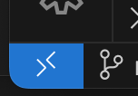

# 基于vs code + docker的远程开发环境

## 背景

公司内部使用服务器集群，按需分配，连上一台机器最多使用10小时。如果某台机器被占用了，那就只能找别的机器使用。这种情况下，如果每天上班第一件事情就是重新配置开发环境，那么真的太痛苦了。因此公司内的best practice就是使用docker。自己的环境就都配置在自己的docker内，下班了就把docker保存，下次要用时重新run就行了。这样就把软件环境与物理机器分离开了，也能避免同事之间因为环境问题互相干扰。

Visual Studio Code作为最强IDE（不接受反驳），不仅可以很方便地在本机开发代码，也可以使用诸如Remote SSH等插件进行远程开发。所谓远程开发，就是所有文件都在服务器上（包括代码、编译器、依赖的库等等），唯独IDE在本地（比如笔记本）。如果服务器上已经配置好了所有环境，那么本地只需要安装好vs code即可，仿佛这个vs code是运行在服务器上，而本地只是一个远程桌面似的。

于是自然而然就有了软件开发的best practice：本地使用vs code连接服务器上的docker。具体而言有两种方法：
1. 在docker container内部开启ssh server，然后用vs code去连接container;
2. vs code先连接宿主机上的ssh server，然后再进入container。

我依次介绍这两种方法，再比较优缺点。

## 方法1

### >>>以正确姿势启动docker container

以ubuntu镜像为例，使用如下命令在服务器上启动docker：

```bash
docker pull ubuntu
docker run -it -p 2233:22 ubuntu:latest bash
```

其中-p 2233:22的含义是把物理机的2233端口映射到container的22端口（22即为ssh服务默认端口）。这样，连接物理机的2233端口就等价于连接container的22端口。

然后在container内部安装ssh：

```bash
apt-get update
apt-get install -y openssh-server
```

在启动ssh服务前，需要修改一下配置文件，允许以root登录：

```bash
apt-get install -y vim
vim /etc/ssh/sshd_config
```

找到PermitRootLogin字段，修改为
```
PermitRootLogin yes
```


然后就可以启动ssh服务：

```bash
service ssh start
```

docker中的root默认是没有密码的。因此还需要为root设置一个密码以便登录：

```bash
echo root:123456789 | chpasswd
```

现在，从笔记本上可以连接container了：

```bash
ssh -p 2233 root@10.176.17.67
```

其中10.176.17.67就是宿主机的IP地址，密码就是12345678。

### >>>在Visual Studio Code中安装Remote SSH插件

远程开发的关键就是Remote SSH插件。在扩展中搜索、安装即可：


安装完之后，能看到vs code窗口左下角状态栏多了一个远程连接的按钮：



点击按钮，窗口上端就会弹出下拉框，选择“连接到主机”：


输入user@host这样的格式，就跟在命令行里使用ssh命令一样：


输入密码：


成功连接后，窗口左下角的的状态栏就会显示当前连接的主机，并且可以使用vs code的资源管理器查看、编辑文件。此时新建终端，就能在服务器上执行命令：


至此，已经能够用vs code在docker中做开发了。

## 方法2

### >>>启动docker container

这种方式中对于启动container的方式没有任何要求。只需要保证container已经在运行即可。仍以ubuntu镜像为例，使用如下最简单的命令在服务器上启动docker：

```bash
docker pull ubuntu
docker run -it ubuntu:latest bash
```

### >>>在Visual Studio Code中安装Remote*插件

我不太清楚具体是哪个插件，但反正将以下这些插件都安装上就能使用远程container开发：


之后，在vs code界面左侧工具栏可以看到“远程资源管理器”，其中有一些之前连接过的快捷入口。点击即可连接。如果没有历史记录，可以点击SSH目录的+即可新建连接。


也可以像方法一中那样直接点左下角“打开远程窗口”按钮，连接宿主机。连接宿主机之后，再次进入“远程资源管理器”，并且将上方的选项框选为“开发容器”，即可看到当前宿主机上运行的容器。点击容器右侧的箭头，attach到容器中：


通过如此两步跳跃，可以看到左下角的连接信息变成了“容器ubuntu:latest(wizardly_jepsen)@ipp2-1911”，也就是vs code知道这是一个远程容器。


## 比较

这两种方法都可以，前者对于vs code而言是透明，分不清是宿主机还是容器，而后者vs code是可感知容器的。我建议优先选择后一种方法，有以下原因：
1. 第一种方法需要端口映射、需要安装配置ssh server，比较繁琐；
2. 有些复杂的容器在使用`docker exec -it <container_id> bash`进入容器终端时，会配置一些环境变量，而直接ssh就会略过这些步骤，导致使用过程中出错（比如Nvidia的NGC上的docker在进入时会配置nvcc路径等）。

## 迁移docker

要下班了，就需要把当前的docker container保存到某个云存储目录里：

```bash
docker ps -a
docker commit b8f8bfb4ae52 my_ubuntu_image
docker save -o my_ubuntu.tar my_ubuntu_image
```

其中b8f8bfb4ae52就是通过docker ps -a看到的当前的container ID。执行完之后，当前目录下就多了一个my_ubuntu.tar文件。

下次要用时，再次装载、运行：

```bash
docker load -i my_ubuntu.tar
docker run -it my_ubuntu_image bash
```

## 自动化脚本
为了方便日常办公，我写了[run_daily.sh](./run_daily.sh)脚本。每天上班前只需要在选定的服务器上执行
```bash
./run_daily.sh
```
就会自动从本地文件中加载docker镜像，或者从远程URL拉取镜像（如果本地文件不存在），然后启动容器，容器会挂载当前目录。这样就可以用vscode连上，开始一天的工作。

当从容器终端退出时，会询问是否需要保存镜像，输入y则保存容器到本地，否则不保存。
